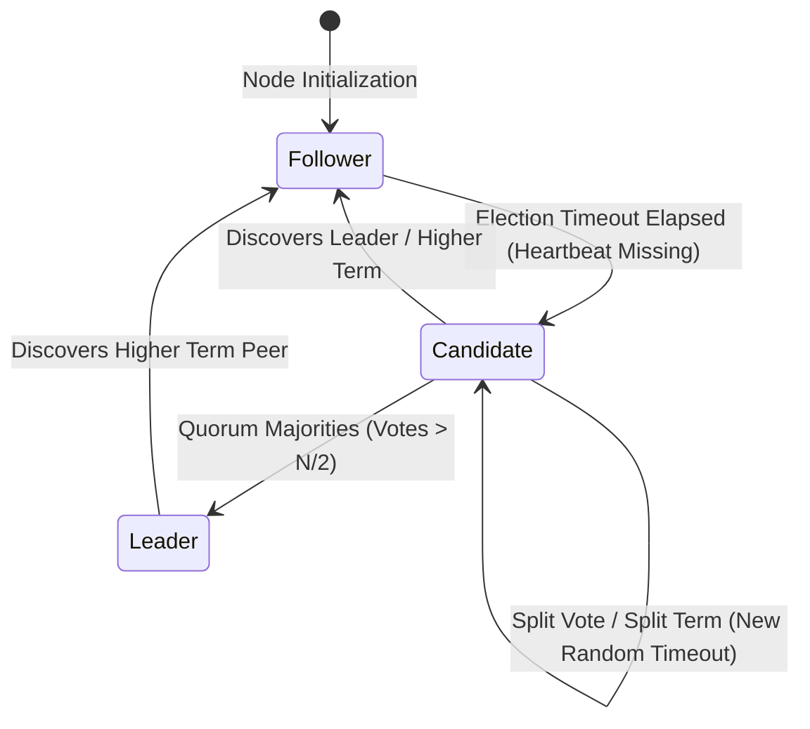

# 🗳️ RaftConsensus — Interactive Distributed Consensus & Chaos Engineering Simulator

[](https://react.dev/)
[](https://www.typescriptlang.org/)
[](https://vite.dev/)
[](https://tailwindcss.com/)

**RaftConsensus** is a high-fidelity visual simulator and interactive chaos engineering laboratory for the Raft Distributed Consensus Algorithm (Ongaro & Ousterhout).

Designed for distributed systems engineers and architects to model, explore, and stress-test leader election, term progression, log entry replication, cluster state partitions, and split-vote scenarios in real time.

---

## 🏛️ Raft State Machine Architecture



---

## ⚡ Core Features & Subsystems

- **Dynamic Cluster Topology (5-Node Mesh)**: Real-time node state visualizer rendering live node roles (*Leader, Candidate, Follower*), current term indices, and vote tallies.
- **Heartbeat & RPC Packet Simulation**: Visualized request-vote and append-entries RPC message passing with configurable latency and drop rates.
- **Chaos Engineering Control Panel**:
  - 💥 **Kill / Revive Nodes**: Inject sudden crash failures to observe automatic failover and leader re-election.
  - 🌐 **Network Partition (Split-Brain)**: Partition the cluster into isolated sub-groups to demonstrate majority vs minority partition safety.
  - ⏱️ **Election Timeout Jitter**: Tweak min/max randomized election timer windows (150ms–300ms) to trigger candidate split-vote contention.
- **Replicated Log & Commit Index Timeline**: Step-by-step uncommitted vs committed log index audit view demonstrating strong leader log matching property.

---

## 🛠️ Tech Stack & Implementation Details

- **Frontend**: React 19, TypeScript, Tailwind CSS, Lucide Icons.
- **State Engine**: Centralized Raft Context State Machine with asynchronous heartbeat timers and message queue dispatchers.
- **Build / Tooling**: Vite 6, Oxlint.

---

## 🚀 Getting Started

```bash
# Clone the repository
git clone https://github.com/freshstart2066-create/raftconsensus.git
cd raftconsensus

# Install dependencies
npm install

# Start local development server
npm run dev
```

---

## 📄 License

Licensed under the **Apache License, Version 2.0**.
